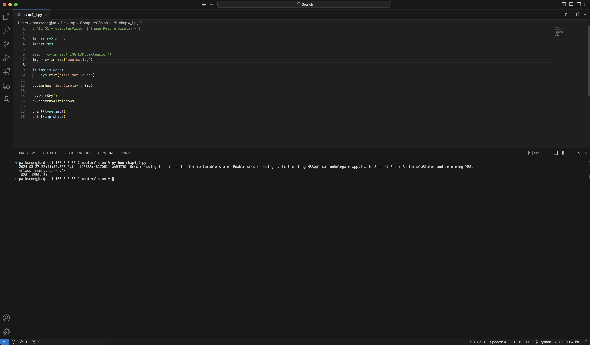

## Lecture4 - OpenCV (Result)

### 4-1 Image Read & Display

---

### 4-2 Image Read & Display - 2

---

### 4-3 Conversion & Resize

---

### 4-4 Webcam

---

### 4-5 Attach Video

---

### 4-6 Insert Figure & Write

---

### 4-7 Insert Figure (Click)

---

### 4-8 Insert Figure (Click & Drag)

---

### 4-9 Painting

